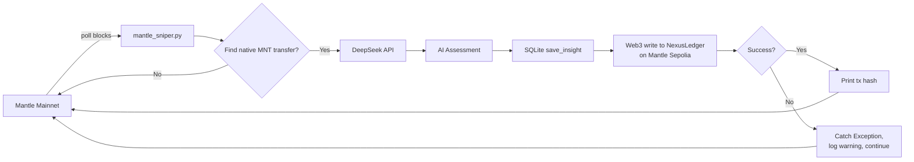

# On-Chain Integration Plan: Stamping AI Insights to NexusLedger

## Overview

Wire [`backend/mantle_sniper.py`](backend/mantle_sniper.py) to automatically write AI-generated transaction assessments on-chain via the deployed [`NexusLedger`](contracts/NexusLedger.sol) contract at `0x641c523a96Fb3561063dC9d386587B50f21512DD` on Mantle Sepolia.

---

## Step-by-Step Plan

### Step 1 — Update [`backend/.env`](backend/.env)

Add the contract address so it can be loaded at runtime:

```
MANTLE_CONTRACT_ADDRESS=0x641c523a96Fb3561063dC9d386587B50f21512DD
```

The file already has `PRIVATE_KEY` and `DEEPSEEK_API_KEY` — no changes needed for those.

---

### Step 2 — Add imports + ABI constant in [`backend/mantle_sniper.py`](backend/mantle_sniper.py)

**Add import** at the top (line ~9, alongside existing imports):

```python
from web3 import Web3
```

**Add ABI constant** near the top of the file (after `RETRY_DELAY` or alongside other constants):

```python
MINIMAL_ABI = [
    {
        "inputs": [
            {"internalType": "string", "name": "_targetTx", "type": "string"},
            {"internalType": "string", "name": "_aiAssessment", "type": "string"},
        ],
        "name": "recordInsight",
        "outputs": [],
        "stateMutability": "nonpayable",
        "type": "function",
    }
]
```

This matches the [`recordInsight(string,string)`](contracts/NexusLedger.sol:11) function exactly.

---

### Step 3 — Set up Web3 connection + account in [`main()`](backend/mantle_sniper.py:105)

Inside `main()`, **immediately after** `load_dotenv()` (line 106), insert:

```python
# --- Web3 connection to Mantle Sepolia for on-chain writes ---
SEPOLIA_RPC = "https://rpc.sepolia.mantle.xyz"
w3 = Web3(Web3.HTTPProvider(SEPOLIA_RPC))
from web3.middleware import geth_poa_middleware
w3.middleware_onion.inject(geth_poa_middleware, layer=0)

private_key = os.getenv("PRIVATE_KEY")
if not private_key:
    print("\n  [!] ERROR: PRIVATE_KEY not found in .env file.")
    print("  [!] On-chain writing will be disabled.")
    return

account = w3.eth.account.from_key(private_key)
print(f"  [MANTLE-NEXUS] Web3 account: {account.address}")
```

**Key details:**
- Uses **Sepolia RPC** (`https://rpc.sepolia.mantle.xyz`) — same as [`deploy_ledger.py`](backend/deploy_ledger.py:27)
- Injects **POA middleware** (`geth_poa_middleware`) — required for Mantle Sepolia's Clique consensus (same pattern as [`deploy_ledger.py:87`](backend/deploy_ledger.py:87))
- Validates `PRIVATE_KEY` exists before proceeding
- Prints the derived account address for verification

---

### Step 4 — Instantiate the contract object

Right after the account setup, add:

```python
contract_address = os.getenv("MANTLE_CONTRACT_ADDRESS")
if not contract_address:
    print("\n  [!] ERROR: MANTLE_CONTRACT_ADDRESS not found in .env file.")
    print("  [!] On-chain writing will be disabled.")
    return

contract = w3.eth.contract(address=contract_address, abi=MINIMAL_ABI)
print(f"  [MANTLE-NEXUS] Contract loaded: {contract_address}")
```

---

### Step 5 — Add on-chain write after [`save_insight()`](backend/mantle_sniper.py:232-235)

Inside the main polling loop, **immediately after** `save_insight()` and `conn.close()` (line 234), add a `try...except` block:

```python
# --- Stamp insight on-chain ---
try:
    tx = contract.functions.recordInsight(tx_hash, assessment).build_transaction({
        "from": account.address,
        "nonce": w3.eth.get_transaction_count(account.address),
    })
    signed_tx = account.sign_transaction(tx)
    tx_hash_onchain = w3.eth.send_raw_transaction(signed_tx.rawTransaction)
    receipt = w3.eth.wait_for_transaction_receipt(tx_hash_onchain)
    print(f"  [MANTLE-NEXUS] 🔗 AI Insight permanently stamped on-chain! Tx: {tx_hash_onchain.hex()}")
except Exception as e:
    print(f"  [MANTLE-NEXUS] ⚠️ On-chain write skipped (RPC rate-limit or error): {e}")
```

**Design decisions:**
- **Let Web3 estimate gas automatically** — by not specifying `gas` or `gasPrice`, Web3 will call `eth_estimateGas` internally (per user requirement)
- **Only `from` and `nonce`** are explicitly provided, keeping it minimal
- **`rawTransaction`** (camelCase) — correct for `web3` v6.x (confirmed by [`deploy_ledger.py:141`](backend/deploy_ledger.py:141))
- **`Exception` catch-all** — ensures the sniper loop never crashes from RPC rate-limiting or transient network issues

---

## Architecture Flow



**Why two different networks?**
- The sniper **monitors** Mantle **Mainnet** (`https://rpc.mantle.xyz`) for real transactions
- The contract was **deployed** on Mantle **Sepolia** (testnet) — so on-chain writes go there
- This is a deliberate demo/audit architecture: monitor production, write assessments to testnet

---

## Files to Modify

| File | Change |
|------|--------|
| [`backend/.env`](backend/.env) | Add `MANTLE_CONTRACT_ADDRESS=0x641c523a96Fb3561063dC9d386587B50f21512DD` |
| [`backend/mantle_sniper.py`](backend/mantle_sniper.py) | Add Web3 import, MINIMAL_ABI, Sepolia connection, account setup, contract instantiation, and on-chain write block |

---

## Risk / Edge Cases

| Risk | Mitigation |
|------|-----------|
| RPC rate-limiting | `except Exception` prevents loop crash; next cycle retries naturally |
| PRIVATE_KEY missing | Early return in `main()` with clear error message |
| Contract address missing | Early return in `main()` with clear error message |
| Nonce mismatch (pending txs) | `get_transaction_count` fetches latest nonce each cycle |
| Gas estimation failure | Web3 auto-estimate; caught by `except Exception` |
