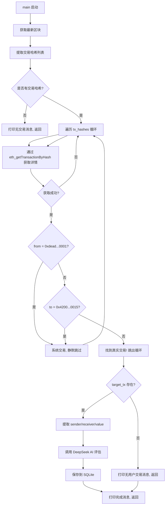

# 智能交易过滤 — L1Block 系统交易跳过逻辑

## 概述

修改 `main()` 函数中的交易提取逻辑，使其遍历区块中的所有交易哈希，过滤掉 L1Block 系统同步心跳交易（`from=0xdead...0001` 或 `to=0x4200...0015`），仅对第一个真实的用户/合约交易执行 DeepSeek AI 评估和 SQLite 持久化。

---

## 核心变更逻辑（仅修改 `main()` 函数）

### 变更前

```python
# 第 140-141 行 — 直接取第一个哈希，不做任何过滤
tx_hash = tx_hashes[0] if isinstance(tx_hashes[0], str) else tx_hashes[0].get("hash", "?")
```

### 变更后

将第 140-191 行的整个流水线替换为以下逻辑：

```
for each tx_hash in tx_hashes:
    fetch transaction details via eth_getTransactionByHash
    extract `from` and `to` fields from the response

    if from_address == "0xdeaddeaddeaddeaddeaddeaddeaddeaddead0001" OR
       to_address == "0x4200000000000000000000000000000000000015":
        this is a system tx → SKIP SILENTLY (no print, no logging)
        continue to next hash

    else:
        this is a real user/contract transaction → TARGET ACQUIRED
        print the target tx_hash
        proceed with DeepSeek AI assessment + SQLite persistence
        BREAK out of the loop

if loop completed without finding any user transaction:
    print graceful message
    exit
```

---

## 详细变更清单

| # | 位置 | 操作 | 说明 |
|---|------|------|------|
| 1 | `main()` 第 140-141 行 | **删除** | 删除原有的 `tx_hash = tx_hashes[0]...` 一行代码 |
| 2 | `main()` 第 140-191 行 | **替换** | 用新的 for 循环 + 地址过滤 + 逻辑分支替换整个交易处理流水线 |

---

## 详细代码结构（替换后）

```
# --- 从第 140 行开始替换 ---

# Loop through all transaction hashes to find a real user transaction
target_tx = None

for tx_hash_str in tx_hashes:
    # Fetch full transaction details
    tx_detail = send_rpc("eth_getTransactionByHash", [tx_hash_str])
    tx_data = tx_detail.get("result", {})

    if not tx_data:
        continue  # skip if fetch failed, try next

    sender = tx_data.get("from", "").lower()
    receiver = tx_data.get("to", "").lower()

    # System heartbeat detection
    L1_BLOCK_SENDER = "0xdeaddeaddeaddeaddeaddeaddeaddeaddead0001"
    L2_SYSTEM_CONTRACT = "0x4200000000000000000000000000000000000015"

    if sender == L1_BLOCK_SENDER or receiver == L2_SYSTEM_CONTRACT:
        # System transaction — skip silently
        continue

    # Real transaction found!
    target_tx = tx_data
    tx_hash = tx_hash_str
    break

if target_tx is None:
    print("\n  [MANTLE-NEXUS] No user transactions in this block. Standing by...")
    print("\n" + "=" * 60)
    return

# --- 原有的 "Target Acquired" + AI + DB 逻辑，使用 target_tx ---
sender = target_tx.get("from", "unknown")
receiver = target_tx.get("to", "unknown")
value_hex = target_tx.get("value", "0x0")
value_wei = int(value_hex, 16)
value_mnt = value_wei / 1e18

print(f"\n  [MANTLE-NEXUS] Target Acquired: {tx_hash}")
# ... rest of existing code (print details, AI assessment, SQLite persistence)
```

---

## 需要修改的代码行摘要

| 行号 (当前) | 操作 | 描述 |
|-------------|------|------|
| 140-141 | ❌ 删除 | `tx_hash = tx_hashes[0]...` — 直接取第一个哈希 |
| 144-146 | ❌ 替换 | 原 `send_rpc("eth_getTransactionByHash", [tx_hash])` 移入循环内 |
| 148-151 | ❌ 替换 | 原先的空检查变为 `continue`，而非直接返回 |
| 153-161 | ❌ 移动 | `sender/receiver/value` 提取逻辑移至循环后的目标处理分支 |
| (新) | ➕ 新增 | `for tx_hash_str in tx_hashes:` 循环结构 |
| (新) | ➕ 新增 | 地址过滤：`if sender == L1_BLOCK_SENDER or receiver == L2_SYSTEM_CONTRACT` |
| (新) | ➕ 新增 | 无用户交易处理分支：打印优雅退出消息 |

---

## 不变部分

- 文件头部导入、常量、辅助函数（`send_rpc`、`get_ip_for_host`、`init_db`、`save_insight`）**完全不变**
- `.env` 配置、`requirements.txt` **无需修改**
- SQLite 持久化逻辑 **保持不变**，仅在找到真实交易后执行
- 所有已有的 error handling 和 retry 逻辑 **保持不变**

---

## Mermaid 流程图



---

## 风险与注意事项

1. **RPC 请求增加**：每个被跳过的系统交易都需要额外的 `eth_getTransactionByHash` 调用。对于仅含系统交易的区块，效率略低于原方案，但可实现精确过滤。
2. **地址比较**：需要 `lower()` 规范化以确保 `from`/`to` 地址的比较不区分大小写——以太坊地址虽为十六进制，但实际比较中以小写规范形式匹配更安全。
3. **`eth_getTransactionByHash` 失败处理**：若某个哈希的 RPC 调用失败，代码应 `continue` 到下一个哈希，而非崩溃退出。

---

## 实施说明

此计划仅修改 `backend/mantle_sniper.py` 中的 `main()` 函数。所有变更集中于第 140 行之后的范围，替换原有的"取第一个哈希 → 获取详情 → AI → DB"流水线。无其他文件需要变更。
