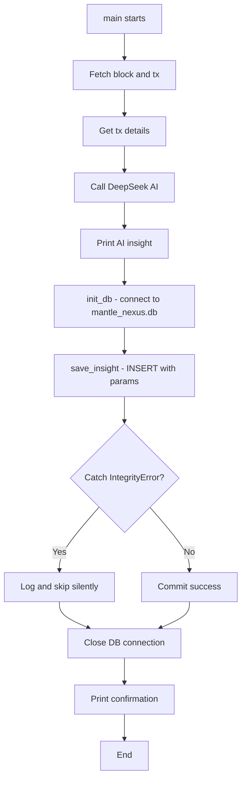

# SQLite Persistence Layer Integration Plan

## Overview

Integrate Python's built-in `sqlite3` module into [`backend/mantle_sniper.py`](backend/mantle_sniper.py) to persist transaction data and AI assessments locally, ensuring data survives process restarts without external dependencies.

---

## Changes Required

### 1. Add `import sqlite3` (line ~12)

Insert after existing stdlib imports (after `import urllib.request` on line 12).

### 2. Add `init_db()` function (before `main()`)

Create a helper function that:
- Connects to `mantle_nexus.db` (creates it if absent)
- Creates the `insights` table via `CREATE TABLE IF NOT EXISTS`
- Returns the connection object

Columns:
| Column | Type | Constraints |
|--------|------|-------------|
| `id` | `INTEGER` | `PRIMARY KEY` |
| `tx_hash` | `TEXT` | `UNIQUE` |
| `sender` | `TEXT` | |
| `receiver` | `TEXT` | |
| `amount_mnt` | `REAL` | |
| `ai_assessment` | `TEXT` | |
| `timestamp` | `DATETIME` | `DEFAULT CURRENT_TIMESTAMP` |

### 3. Add `save_insight()` function (before `main()`)

A helper that accepts `(conn, tx_hash, sender, receiver, amount_mnt, assessment)` and:
- Inserts a row using parameterized SQL (`?` placeholders) to prevent injection
- Wraps in try/except — catches `sqlite3.IntegrityError` for duplicate hash handling
- Calls `conn.commit()` on success

### 4. Wire into `main()` (after AI assessment)

**Location**: After line 154 (`print(f"\n  [MANTLE-NEXUS AI INSIGHT] {assessment}")`)

Add:
```python
conn = init_db()
save_insight(conn, tx_hash, sender, receiver, value_mnt, assessment)
conn.close()
print("  [MANTLE-NEXUS] Data saved to local SQLite DB.")
```

### 5. Handle edge cases

- **Duplicate `tx_hash`**: `IntegrityError` caught silently (graceful skip).
- **DB file location**: Created in the **current working directory** (the `backend/` dir when run from there).
- **DB connection failure**: Caught generically so the main flow isn't disrupted.

---

## Execution Plan

| Step | File | Action |
|------|------|--------|
| 1 | `backend/mantle_sniper.py:12` | Add `import sqlite3` |
| 2 | `backend/mantle_sniper.py` (before `main`) | Add `init_db()` function |
| 3 | `backend/mantle_sniper.py` (before `main`) | Add `save_insight()` function |
| 4 | `backend/mantle_sniper.py:155` (after AI print) | Wire in DB save + print confirmation |
| 5 | `backend/mantle_nexus.db` | Auto-created at first run |

No changes needed to `requirements.txt` since `sqlite3` is built-in.

---

## Mermaid Flow



---

## Files Modified

- [`backend/mantle_sniper.py`](backend/mantle_sniper.py) — the only file changed
