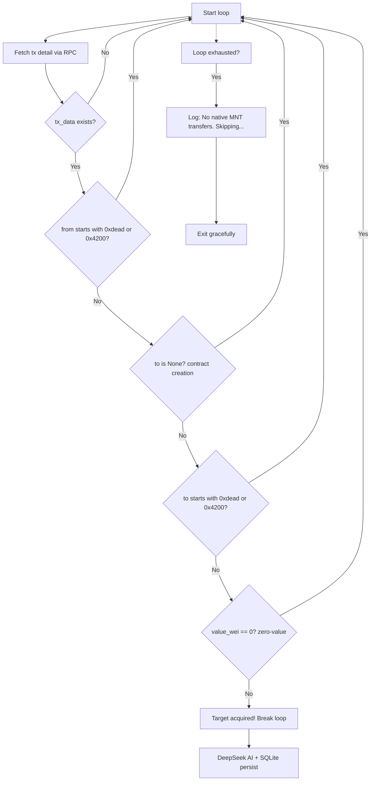

# Strict Native MNT Transfer Filter Plan

## 概述

修改 [`backend/mantle_sniper.py`](backend/mantle_sniper.py) 中的交易过滤循环，从当前的"精确系统地址匹配"升级为"严格原生 MNT 转账检测"，确保只有真正转移了原生 MNT 的交易进入 DeepSeek AI 评估和 SQLite 持久化。

---

## 当前 vs 目标行为

| 维度 | 当前行为 | 目标行为 |
|------|---------|---------|
| `from` 过滤 | 精确匹配 `0xdeaddeaddeaddeaddeaddeaddeaddeaddead0001` | 前缀匹配：不以 `0xdead` 或 `0x4200` 开头 |
| `to` 过滤 | 精确匹配 `0x4200000000000000000000000000000000000015` | 前缀匹配：不为 None（排除合约创建）且不以 `0xdead` 或 `0x4200` 开头 |
| `value` 过滤 | 无条件接受任何 value | **必须 > 0 MNT**（排除零值交互） |
| 无匹配日志 | `No user transactions in this block. Standing by...` | `No native MNT transfers in this block. Skipping...` |

---

## 需要修改的代码段

### 修改范围

只修改 [`backend/mantle_sniper.py`](backend/mantle_sniper.py) 中 `main()` 函数的第 **140-169** 行（过滤循环 + 无匹配分支）。

### 变更前代码（第 140-169 行）

```python
    # --- Loop through transactions to find a real user tx ---
    L1_BLOCK_SENDER = "0xdeaddeaddeaddeaddeaddeaddeaddeaddead0001"
    L2_SYSTEM_CONTRACT = "0x4200000000000000000000000000000000000015"

    target_tx = None
    tx_hash = None

    for tx_hash_str in tx_hashes:
        tx_detail = send_rpc("eth_getTransactionByHash", [tx_hash_str])
        tx_data = tx_detail.get("result", {})

        if not tx_data:
            continue

        sender_addr = tx_data.get("from", "").lower()
        receiver_addr = tx_data.get("to", "").lower()

        # Skip L1Block system heartbeat transactions silently
        if sender_addr == L1_BLOCK_SENDER or receiver_addr == L2_SYSTEM_CONTRACT:
            continue

        # Real user/contract transaction — target acquired!
        target_tx = tx_data
        tx_hash = tx_hash_str
        break

    if target_tx is None:
        print("\n  [MANTLE-NEXUS] No user transactions in this block. Standing by...")
        print("\n" + "=" * 60)
        return
```

### 变更后代码（第 140-174 行）

```python
    # --- Loop through transactions to find a real native MNT transfer ---
    SYSTEM_PREFIXES = ("0xdead", "0x4200")

    target_tx = None
    tx_hash = None

    for tx_hash_str in tx_hashes:
        tx_detail = send_rpc("eth_getTransactionByHash", [tx_hash_str])
        tx_data = tx_detail.get("result", {})

        if not tx_data:
            continue

        sender_addr = tx_data.get("from", "").lower()

        # Skip system contracts (0xdead... or 0x4200...)
        if sender_addr.startswith(SYSTEM_PREFIXES):
            continue

        # Skip contract creations (to is None) or system contract receivers
        receiver_addr = tx_data.get("to")
        if receiver_addr is None:
            continue
        if receiver_addr.lower().startswith(SYSTEM_PREFIXES):
            continue

        # Skip zero-value transactions (no native MNT transfer)
        value_hex = tx_data.get("value", "0x0")
        value_wei = int(value_hex, 16)
        if value_wei == 0:
            continue

        # Real native MNT transfer — target acquired!
        target_tx = tx_data
        tx_hash = tx_hash_str
        break

    if target_tx is None:
        print("\n  [MANTLE-NEXUS] No native MNT transfers in this block. Skipping...")
        print("\n" + "=" * 60)
        return
```

---

## 关键设计决策

### 1. 前缀匹配而非精确匹配
- 系统合约家族以 `0xdead` 和 `0x4200` 开头，包含多个变体（例如 `0xdeaddeaddeaddeaddeaddeaddeaddeaddead0001`、`0x4200000000000000000000000000000000000015` 等）
- 使用 `str.startswith(tuple)` 进行前缀匹配，一次性覆盖所有变体

### 2. 合约创建检测
- 以太坊 RPC 中，合约创建交易的 `to` 字段为 `null`
- 使用 `tx_data.get("to")`（不带默认值）获取原始值
- 先检查 `is None` 再调用 `.lower()`，避免 `AttributeError`

### 3. 零值转账过滤
- `value` 字段以十六进制字符串形式返回（如 `0x0`）
- 转换为 wei 整型后检查 `== 0`
- 仅 > 0 的交易才视为真实 MNT 转账

### 4. 日志信息更新
- 从 `No user transactions in this block. Standing by...` 改为 `No native MNT transfers in this block. Skipping...`
- 语义更精确，反映过滤条件的升级（不仅仅是"用户交易"，而是"原生 MNT 转账"）

---

## 不变部分

- 文件头部导入、常量、辅助函数（`send_rpc`、`get_ip_for_host`、`init_db`、`save_insight`）**完全不变**
- DeepSeek AI 评估逻辑 **不变**
- SQLite 持久化逻辑 **不变**
- `.env` 配置、`requirements.txt` **无需修改**
- RPC retry 和错误处理逻辑 **不变**

---

## 实施检查清单

| # | 操作 | 文件 | 行号 |
|---|------|------|------|
| 1 | 删除 `L1_BLOCK_SENDER` 和 `L2_SYSTEM_CONTRACT` 常量定义 | `backend/mantle_sniper.py` | 141-142 |
| 2 | 添加 `SYSTEM_PREFIXES = ("0xdead", "0x4200")` | `backend/mantle_sniper.py` | 141（原位置） |
| 3 | 修改 `from` 过滤条件为前缀匹配 | `backend/mantle_sniper.py` | 154-155 |
| 4 | 添加 `to` 非 None 检查（合约创建） | `backend/mantle_sniper.py` | 158-160 |
| 5 | 修改 `to` 过滤条件为前缀匹配 | `backend/mantle_sniper.py` | 161-162 |
| 6 | 添加 `value > 0` 检查（零值过滤） | `backend/mantle_sniper.py` | 165-168 |
| 7 | 更新无匹配时的日志消息 | `backend/mantle_sniper.py` | 172-173 |
| 8 | 更新注释（`user tx` → `native MNT transfer`） | `backend/mantle_sniper.py` | 140 |

---

## Mermaid 流程图



---

## 风险与注意事项

1. **`to` 为 `None` 时的安全处理**：`tx_data.get("to")` 可能返回 `None`（合约创建），必须在调用 `.lower()` 之前检查，否则引发 `AttributeError`。
2. **`from` 字段**：规范中 `from` 永远不为空，但使用 `tx_data.get("from", "")` 保证安全。
3. **前缀通用性**：`0xdead*` 覆盖 `0xdeaddeaddeaddeaddeaddeaddeaddeaddead0001` 等 L1 系统合约；`0x4200*` 覆盖 L2 系统合约家族的多个变体。
4. **零值交易**：合约交互（如 ERC-20 approve）通常 value=0，这些会被排除，符合 MVP 需求。
